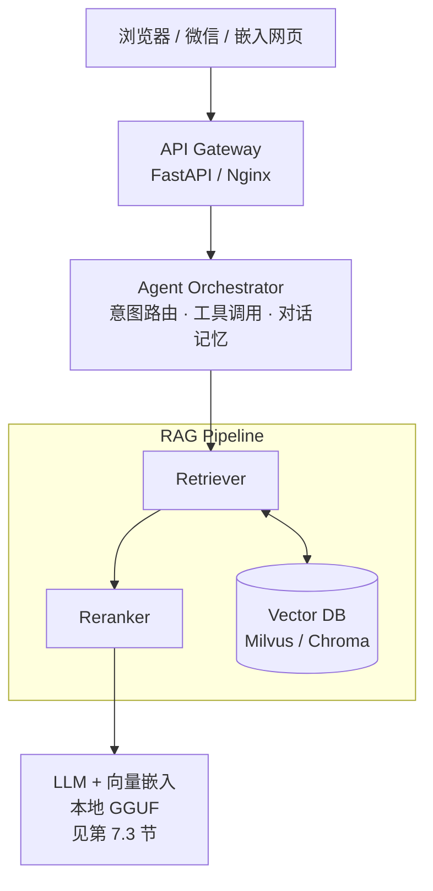

# Know Me — 个人数字分身（Personal Digital Twin）— 产品需求文档（PRD）

> **Know Me** 是一个 **个人数字分身**（Personal Digital Twin）。本文为该产品的 **产品需求文档（PRD）**，描述产品目标、范围、架构与非功能需求，便于对齐预期与迭代规划。

---

## 1. 文档信息

| 项 | 内容 |
|----|------|
| 产品名称 | Know Me |
| 产品定位 | 个人数字分身（Personal Digital Twin） |
| 文档类型 | 产品需求文档（PRD） |
| 状态 | 草案（随产品版本迭代更新） |
| 知识截止 | 由运营者在系统配置中维护，并在对话中明示 |

---

## 2. 背景与问题陈述

### 2.1 背景

**Know Me** 是一个 **个人数字分身**（Personal Digital Twin）：基于 **个人授权资料** 的问答与对话能力，对外展示个人技术观点、经历与常见问题答复；并覆盖 **面试前期** 招聘方 HR 的常规信息澄清（如地点、到岗、流程、公开履历要点等），体现 **RAG + Agent** 的工程化能力。

### 2.2 要解决的问题

- 访客希望快速了解「你是谁、做什么、技术栈与观点」等，但静态页面信息密度有限。
- **招聘方 HR** 在初筛电话/邮件前，希望一次性获得 **口径一致、可引用出处** 的基础信息，减少反复追问与误解。
- 纯大模型回答易产生 **幻觉**，且无法对齐个人真实表述与时间线。
- 需要可 **持续更新** 的知识管道与可 **度量优化** 的检索质量。

### 2.3 非目标（本期不做或明确降级）

- 不承诺替代真人沟通（招聘、商务、法律等需人工确认）。
- **HR 答疑不等于录用承诺或薪酬谈判**：不涉及替本人表态「已接受 offer」「薪资底线」等；此类问题引导至真人沟通或日历预约。
- 不处理未脱敏的私密对话全量导入（除非单独合规评审）。
- 不作为多租户 SaaS 的完整计费与权限体系（MVP 阶段可单用户/单空间）。

---

## 3. 产品愿景与目标

### 3.1 愿景

在 **可验证事实** 的前提下，用自然语言呈现个人知识体系，并形成可演进、可观测、可开源展示的技术名片：**Know Me** 作为个人数字分身（Personal Digital Twin）承载上述体验。

### 3.2 产品目标（可验收）

| 目标 | 说明 | MVP 验收 |
|------|------|----------|
| 事实一致性 | 优先基于资料库回答，禁止无依据捏造 | 抽检问答中「有据引用」比例达标（团队自定阈值） |
| 可解释性 | 答案能关联到来源与时间 | 展示或日志中可追溯 source / date |
| 体验 | 流式输出、Markdown、代码高亮 | `/chat` SSE 或等价流式协议可用 |
| 可运维 | 可重建索引、可回放问题 | 一键脚本或文档化流程 |
| 安全隐私 | 分级资料与脱敏策略 | 敏感字段不入库或打码 |
| HR 初筛覆盖 | 高频 HR 问题有标准口径与出处 | 预设 `hr_screening` 类文档命中与拒答边界用例通过 |

---

## 4. 用户与场景

### 4.1 目标用户

- **访客**：同行、候选人、合作方、读者。
- **招聘方 HR / 猎头（初筛阶段）**：需要核对基础信息、流程与公开口径，而非替代业务面或定薪。
- **运营者（本人）**：维护资料、调优检索、查看反馈与日志。

### 4.2 核心用户故事

1. 作为访客，我希望用自然语言提问并得到 **基于本人公开资料** 的回答。
2. 作为访客，当问题模糊时，我希望系统 **追问澄清** 而不是瞎猜。
3. 作为访客，当问题与本人无关时，我希望得到 **礼貌拒答** 与引导。
4. 作为运营者，我希望在更新文章或 FAQ 后能 **增量或全量** 更新知识库。
5. 作为 HR，我希望在电话前快速确认 **期望城市、是否远程、到岗周期、签证/工签（如适用）、当前流程阶段** 等，且答案与本人资料一致。
6. 作为 HR，当问题涉及 **具体薪酬数字、股票细节、未公开公司信息** 时，我希望得到明确边界说明，并引导至本人或正式渠道确认。
7. 作为 HR，我希望在需要安排下一步时，能看到 **预约面试/技术沟通** 的链接或联系方式（若运营者在知识库中提供）。

---

## 5. 功能需求

### 5.1 对话（P0）

- 支持多轮对话，保留最近 N 轮上下文（可配置，默认建议 6 轮窗口）。
- 支持流式响应（降低首字延迟）。
- 输出支持 Markdown；代码块高亮（前端或渲染层实现）。

### 5.2 检索增强生成 RAG（P0）

- 文档加载、切分、嵌入、写入向量存储。
- 建议默认参数：`chunk_size` 约 512、`chunk_overlap` 约 50（可配置）。
- 每条 chunk 附带元数据，至少包含：

```json
{
  "source": "blog_2025_career_advice",
  "date": "2025-04-01",
  "topic": "创业/技术管理",
  "audience": "general",
  "privacy_level": "public"
}
```

其中 `audience` 可选值示例：`general`、`hr_screening`，便于检索时按场景加权或过滤（后续版本可选）。

- **混合检索（P1）**：向量语义检索 + 关键词（BM25 或等价稀疏检索），专有名词场景优先启用。
- **查询改写（P1）**：对模糊问题生成多查询，合并去重后再检索。
- **重排序 Rerank（P1）**：初检 top-K（如 20）→ 重排 → 最终 top-N（如 5）。

### 5.3 Agent 编排（P0/P1）

**MVP（P0）**：单 Agent + 检索工具 + 系统提示词约束。

**增强（P1）**：轻量工作流（路由 → 检索子流程 → 基于证据回答 → 低置信度澄清）。

**工具（按需迭代）**

| 工具 | 优先级 | 说明 |
|------|--------|------|
| `search_personal_knowledge` | P0 | 个人资料检索 |
| `ask_user_clarify` | P0 | 低相关度或歧义时追问 |
| `get_current_time` | P2 | 若启用实时性 |
| `search_public_web` | P2 | 仅公开、合规场景；需白名单与审计 |
| `send_feedback_email` / `schedule_demo` | P3 | 需明确授权与防滥用 |

### 5.4 系统提示词原则（P0）

- 身份：你是 **Know Me**，即本人的 **个人数字分身**（Personal Digital Twin），经本人授权呈现；性格与表达风格可配置。
- **必须优先检索**；无检索证据则拒答或追问，严禁编造。
- **冲突处理**：不同时期观点需并列说明来源与时间，并概括演变原因（若资料中有依据）。
- **越权拒答**：与本人无关的通用任务（如「写个快排」）可礼貌拒绝并引导回「关于我的问题」。
- **HR 场景**：见 **第 5.9 节**；对无资料支撑的敏感项一律不推测、不替本人承诺。

### 5.5 自我修正检索（P1）

- 当检索置信度低于阈值（例如最大相似度低于可配置阈值）时，触发澄清话术，而非强行回答。

### 5.6 数据源与知识工程（P0 管道 + P1 扩展）

| 类型 | 来源示例 | 抽取方式 |
|------|----------|----------|
| 文章/博客 | 个人站、专栏 | RSS / 导出 Markdown |
| 社交言论 | X、即刻、微博等 | API 或导出（合规） |
| 技术分享 | PPT、演讲视频 | PPT 文本 + Whisper 字幕 |
| 代码思想 | README、设计说明 | 仅自然语言描述入库 |
| 个人 FAQ | 高频问答 | 手工 YAML |
| **HR 初筛口径包** | 本人编写的 `hr_faq.yaml` / `hr_screening.md` | 仅收录你愿意对招聘方公开的条目；与简历、LinkedIn 口径对齐并标注更新日期 |
| 对话样例 | 历史工作聊天 | **脱敏**后人工挑选 |

### 5.7 观测与反馈（P1）

- 记录：用户问题、改写查询、命中片段 id、rerank 分数、模型版本、延迟、token 用量。
- 可选：点赞/点踩、简短反馈文本，写入关系库便于后续优化。

### 5.8 评测与回归（P1，强烈建议）

- 维护 100～200 条标注用例，分桶：事实、观点、时间、模糊、越权、**HR 初筛**（含应答 / 应拒答 / 应转人工）等。
- 指标示例：检索召回、答案事实一致性、拒答准确率、P95 延迟。
- 每次调整分块、元数据、rerank、prompt 时跑回归集。

### 5.9 面试前期 HR 答疑（场景需求）

**定位**：在候选人本人授权的资料范围内，回答招聘方在 **初筛阶段** 常见、重复性高的问题，减少沟通摩擦；**不替代** HR 合规审查、背景调查结论或录用决策。

**建议覆盖的问题类型（资料中需有明确条文）**

| 类别 | 示例问题 | 产品行为 |
|------|----------|----------|
| 履历与时间线 | 最近一段工作经历、职级、汇报关系 | 仅复述资料与日期；冲突时按 **第 5.4 节** 冲突策略 |
| 地点与用工 | 期望城市、是否接受搬迁/混合办公 | 无资料则追问或建议邮件确认 |
| 流程与时间 | 到岗时间、面试可用时段、是否在职 | 到岗仅给 **区间或原则**（若本人已写入）；避免精确到未公开的内部节点 |
| 公开技术栈 | 常用语言/框架（与简历一致） | 检索简历类 chunk |
| 边界问题 | 当前薪酬、竞品细节、未公开项目 | **拒答或转人工**；不调用「猜一个数」式生成 |

**话术与体验**

- 开场或页脚可提示：「以下信息来自本人维护的公开资料，**不构成录用或薪酬承诺**。」
- 回答尽量短、条目化，便于 HR 复制到 ATS 备注（可选：提供「仅要点」模式为 P2）。
- 对「是否已拿其他 offer」等敏感问题：默认 **不回答**，引导「由候选人本人与贵司沟通」。

**意图与路由（P1，可与通用问答共用）**

- 识别 `hr_screening` 意图后，检索可对 `audience: hr_screening` 或 `topic` 含招聘元数据的 chunk 加权。
- 与 **第 5.3 节** 中 `schedule_demo` 等工具结合时，仅展示知识库内已配置的链接，禁止模型编造 URL。

---

## 6. 非功能需求

### 6.1 性能

- 首 token 延迟与端到端 P95 延迟目标由部署环境定义；MVP 以「可感知流畅」为准。

### 6.2 可用性与可靠性

- 向量库与索引可重建；关键配置环境变量化。
- 对外 API 错误码语义化，避免泄露内部栈信息。

### 6.3 安全与隐私

- **隐私分级**：`public` / `internal` / `private`（或等价枚举），检索与展示层按角色过滤。
- **PII 脱敏**：邮箱、手机、证件、未公开地址等入库前清洗或拒绝。
- **审计**：联网工具调用、邮件发送类工具必须记审计日志。

### 6.4 成本

- 嵌入固定为 **本地 Qwen3-Embedding-4B-GGUF**；**重排（rerank）** 仍可本地或 API（P1）；对高频问题启用缓存（P2）。

---

## 7. 系统架构（目标态）



### 7.1 技术选型建议（与 PRD 对齐）

| 层级 | 建议 | 说明 |
|------|------|------|
| 语言与框架 | Python + FastAPI | `/chat` 流式 API，前后端解耦 |
| RAG 框架 | LlamaIndex（主） | 文档管道、元数据、索引抽象成熟 |
| Agent | LlamaIndex ReAct 或轻工作流 | MVP 从简；复杂后再拆子图 |
| 向量库 | Milvus（目标）/ Chroma（MVP） | Milvus 支持标量过滤与扩展；本地 Chroma 零配置验证 |
| 嵌入 | **[Qwen/Qwen3-Embedding-4B-GGUF](https://huggingface.co/Qwen/Qwen3-Embedding-4B-GGUF)**（**Q4_K_M**） | 作为本方案 **唯一** 向量嵌入来源：承担 RAG 语义检索与入库向量化；与常见 API / 小参数嵌入相比，**4B + Qwen 系** 在中文与长文本上通常更强，且数据不出本地。量化相对全精度可能有小幅差异，**以自建评测集召回为准**。部署要求：推理栈须 **支持该 GGUF 的嵌入推理**（见第 7.3 节）。 |
| 可选 | Redis 缓存、MinIO 对象存储 | 视部署与附件需求 |

### 7.2 与 Java 生态集成（远期）

- 若需与企业内 Java 系统深度集成，可评估 **Spring AI** / **LangChain4j**；原型阶段 Python 性价比更高。

### 7.3 本地 GPU 与模型（规划）

**当前选定（GGUF + Q4_K_M）**

- **对话 / Agent 主模型**：[unsloth/Qwen3.5-4B-GGUF](https://huggingface.co/unsloth/Qwen3.5-4B-GGUF)（**Q4_K_M**）
- **向量嵌入**：[Qwen/Qwen3-Embedding-4B-GGUF](https://huggingface.co/Qwen/Qwen3-Embedding-4B-GGUF)（**Q4_K_M**）

**硬件**

- **NVIDIA P100（16GB 显存）**，Pascal / 计算能力约 6.0：无新一代 Tensor Core，但跑 **GGUF + CUDA（如 llama.cpp 系）** 做本地推理与嵌入仍可行；需保证驱动与 CUDA 版本与所选推理栈兼容（P100 对部分新 CUDA 大版本存在上限，以发行说明为准）。

**权重一览（与上「当前选定」一致；9B 为可选升级）**

| 角色 | 模型分发 | 量化 | 说明 |
|------|------|------|------|
| 对话 / Agent 主模型（**当前**） | [unsloth/Qwen3.5-4B-GGUF](https://huggingface.co/unsloth/Qwen3.5-4B-GGUF) | Q4_K_M | 与嵌入同系列生态；**权重 + KV** 小于 9B，在 P100 16GB 上更易与 4B 嵌入同卡或拉大 `n_ctx`。 |
| 对话 / Agent 主模型（可选升级） | [unsloth/Qwen3.5-9B-GGUF](https://huggingface.co/unsloth/Qwen3.5-9B-GGUF) | Q4_K_M | 能力更强；显存与 KV 压力更大，与嵌入同卡需实测，必要时嵌入离线或分卡/CPU。 |
| 向量嵌入 | [Qwen/Qwen3-Embedding-4B-GGUF](https://huggingface.co/Qwen/Qwen3-Embedding-4B-GGUF) | Q4_K_M | 官方提供多档 GGUF；嵌入维度、指令前缀等以模型卡为准。 |

**主对话 GGUF 文件（Unsloth）**

- 对话权重来自 **[unsloth/Qwen3.5-4B-GGUF](https://huggingface.co/unsloth/Qwen3.5-4B-GGUF)**，本方案约定 **Q4_K_M**，文件名示例：**`Qwen3.5-4B-Q4_K_M.gguf`**；其它档位与说明以**模型卡 / 模型分发方文档**为准。
- **纯文本** RAG / 聊天：通常 **仅加载**上述主 GGUF。若将来启用 **图像输入**，再按**模型分发方文档**按需加载 **`mmproj-*.gguf`**。

**9B 与 4B（GGUF）在 P100 16GB 上的取舍（简要）**

| 维度 | 9B Q4_K_M | 4B Q4_K_M |
|------|-----------|-----------|
| 显存压力 | 较高，宜控制 `n_ctx`、并发 | 较低，更易 **主模型 + 嵌入** 同卡常驻或更大上下文 |
| 适用场景 | 长推理、复杂 Agent 工具编排、生成质量要求高 | HR 答疑、强 RAG 约束下的短答、首轮 MVP 更稳 |
| 与嵌入 4B 同机 | 建议嵌入离线或分进程；同卡双载需 profiling | 同卡双载 **成功概率更高**，仍建议做一次显存峰值测试 |

**显存与部署策略（16GB 上建议）**

- **不要默认假设「两路模型常驻同一进程且各占满 VRAM」**：对话时主模型 + 中间激活与 KV 已占大头；若再常驻 4B 嵌入，总占用需实测。可行做法包括：**嵌入独立进程 / 批量离线建索引时单独加载嵌入**；嵌入走 **CPU（llama.cpp CPU 后端）**；对话结束后再跑大批量向量化。
- **索引构建与在线问答分离**：Milvus/Chroma 建库阶段只跑嵌入；线上 `/chat` **仅加载主对话模型**（当前为 **4B**；若升级为 9B 则同理），避免与大批量嵌入峰值叠加。

**工程集成注意**

- 主模型 GGUF 常见路径：**Ollama**、**llama.cpp** / **llama-cpp-python**、**LM Studio** 等；须与 Agent/RAG 编排及 API 网关所选 **OpenAI 兼容接口** 或等价原生接口 **一致**。
- **嵌入** 仅使用 **Qwen3-Embedding-4B-GGUF**：上线前须验证推理栈支持 **该模型的 GGUF 嵌入推理**（与 Transformers 加载 **非 GGUF** 权重不是同一路径）。若与全精度权重对比有差异，以 **召回评测** 决定是否保留 Q4_K_M 或换更高量化档（仍在**同一模型分发**提供的其它档位中选择）。

---

## 8. 数据模型（逻辑）

- **Document**：原始文件或 URL、哈希、更新时间、隐私级别。
- **Chunk**：文本片段、嵌入向量、元数据（source、date、topic…）。
- **Session / Message**：会话与消息（可选持久化）。
- **Feedback**：点踩原因、关联 message_id（可选）。

---

## 9. API 草案（MVP）

| 方法 | 路径 | 说明 |
|------|------|------|
| POST | `/chat` | 请求体含 `messages` 或 `query` + `session_id`；响应 SSE 流式 token / 事件 |
| POST | `/ingest` | 运营者鉴权下触发增量入库 |
| GET | `/health` | 健康检查 |

---

## 10. 里程碑与交付节奏

### 10.1 周末 MVP（建议）

1. **D1 上午**：知识库最小语料（含 `about_me`、`faq`、**`hr_faq` / `hr_screening` 口径包**）完成加载、切分与向量索引，检索链路自测（含若干 HR 典型问法）。
2. **D1 下午**：Agent 编排与检索工具在无图形界面环境下可完成端到端验证。
3. **D2 上午**：对外对话接口（含流式）与最小可用交互形态联调通过。
4. **D2 下午**：在目标部署环境完成可访问发布，小范围试用并收集反馈。

### 10.2 两周增强

- 混合检索 + rerank + 查询改写。
- 评测集与回归脚本。
- Milvus 标量过滤与按年分区（练习与性能并存）。
- CI：资料源更新后自动触发索引重建（可选）。

---

## 11. 风险与对策

| 风险 | 对策 |
|------|------|
| 幻觉 | 强制证据引用；低置信度追问；评测回归 |
| 隐私泄露 | 分级、脱敏、工具白名单与审计 |
| 检索漏召 | 混合检索、改写、调 chunk 与元数据 |
| 成本失控 | 缓存、小模型路由、限流 |
| 法律与平台 ToS | 爬虫/API 使用前合规检查 |
| HR 场景误导 | 薪酬等无资料拒答；提示「以候选人本人确认为准」；评测集含红线用例 |

---

## 12. 开源与品牌（可选）

- 若产品 **对外开源或公开展示**：应在产品界面或随附法律文本中载明 **免责声明**（非法律意见、非官方招聘承诺、**不构成对薪资/股权/录用与否的任何承诺** 等）。
- 页脚提示示例：「**Know Me** 基于本人授权资料构建，答案力求有据；仍可能存在遗漏，请以原始出处为准。」
- **面向 HR 的补充提示示例**：「**Know Me** 所展示内容仅供初筛信息参考，招聘条件、流程与薪酬以贵司与候选人正式沟通及书面文件为准。」

---

## 13. 产品 Backlog（执行拆解）

Epic / Story 清单及与 **GitLab 议题、里程碑、标签** 的对齐方式见 **[product/backlog/README.md](product/backlog/README.md)**。
