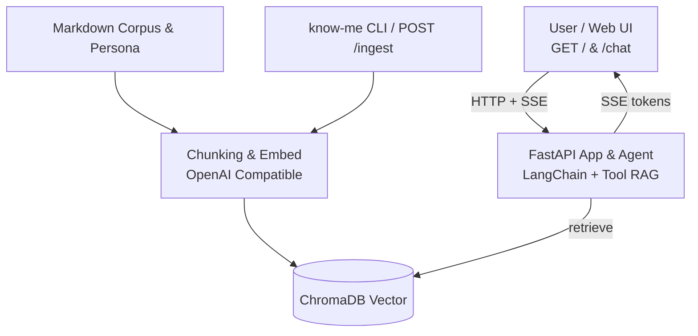

# Know Me

**Know Me** 是一个面向个人数字分身（Personal Digital Twin）的开源参考实现。它将你的个人授权语料、技术履历与问答知识库载入本地向量数据库，结合 **RAG（检索增强生成）与多轮智能体（Agent）** 技术，提供具备来源出处引用、人设价值观对齐以及 HR 招聘初筛增强的交互式对话能力。

---

## 核心特性 (Key Highlights)

- 🔒 **隐私优先与本地化支持**：
  - 支持完全离线或私有化部署。兼容 [LM Studio](https://lmstudio.ai/)、[Ollama](https://ollama.com/)、[vLLM](https://github.com/vllm-project/vllm) 等本地大模型网关，以及任何 OpenAI 兼容 API。
  - 核心语料（`corpus/`）与人设（`persona/`）默认纳入 Git 忽略列表，绝不意外泄露个人隐私数据。
- 📚 **基于出处的 RAG 检索体系**：
  - 支持多层级 Markdown 语料解析、YAML 头信息与分块切分。
  - 使用本地持久化 Chroma 向量库，回答具备可追溯的文档片段与主题标签。
- 🎭 **声明式人设与价值观边界 (Persona & Soul)**：
  - 通过 `IDENTITY.md`（身份认同、欢迎语）与 `SOUL.md`（三观与行为边界）灵活调校分身语气与安全边界。
- 💼 **HR 招聘初筛增强 (HR Screening Boost)**：
  - 针对招聘流程、初筛口径、工作期望等意图进行智能识别，并对 `hr_faq` 与 `hr_screening` 语料实施优先召回与重排。
- ⚡ **现代工程化与开箱即用**：
  - 内置基于 SSE（Server-Sent Events）的流式 Web 聊天页面，支持打字机效果、头像与在线简历外链。
  - 提供单命令 Docker Compose 快速启动与全功能 CLI 工具箱。

---

## 系统架构 (Architecture)


---

## 快速开始 (Quickstart)

### 方式 A：Docker Compose 快速启动（推荐）

仓库已内置脱敏示例语料（`corpus.example/`）与示例人设（`persona.example/`），克隆即可直接体验：

```bash
# 1. 复制环境配置
cp .env.example .env
# 编辑 .env 配置你的 OPENAI_BASE_URL、CHAT_MODEL 与 EMBED_MODEL

# 2. 构建镜像并后台启动服务
docker compose build
docker compose up -d

# 3. 检查健康状态（HTTP 200）
curl http://127.0.0.1:8000/health

# 4. 浏览器访问 Web 聊天界面
# 打开 http://127.0.0.1:8000/

# 5. 停止容器
docker compose down
```

### 方式 B：本地 Python 环境

```bash
# 1. 创建并激活虚拟环境 (Python >= 3.10)
python3 -m venv .venv
source .venv/bin/activate   # Windows: .venv\Scripts\activate

# 2. 安装可编辑依赖
pip install -e .

# 3. 复制配置
cp .env.example .env

# 4. 基于示例语料构建向量索引（需确保嵌入模型已配置且可用）
know-me build-index --corpus-root corpus.example

# 5. 单次问答测试（流式打印至终端）
know-me query "请做个自我介绍"

# 6. 终端交互式多轮对话
know-me chat

# 7. 启动 HTTP 服务与 Web 界面（浏览器打开 http://127.0.0.1:8000/ ，API 文档位于 /docs）
know-me serve --host 127.0.0.1 --port 8000
```

---

## 配置说明 (Configuration)

复制 `.env.example` 为 `.env` 后进行调整，核心配置项如下：

| 环境变量 | 必填 | 默认值 | 说明 |
| :--- | :---: | :--- | :--- |
| `KNOW_ME_OPENAI_BASE_URL` | 是 | `http://127.0.0.1:1234/v1` | 兼容 OpenAI 协议的接口根地址（须包含 `/v1`） |
| `KNOW_ME_OPENAI_EMBED_MODEL` | 是 | - | 向量嵌入模型标识（建索引与检索时须严格一致） |
| `KNOW_ME_OPENAI_CHAT_MODEL` | 是 | - | 对话推理模型标识 |
| `KNOW_ME_OPENAI_API_KEY` | 否 | `""` | 模型服务 API Key（本地 LM Studio 等通常可留空） |
| `KNOW_ME_CORPUS_ROOT` | 否 | `corpus` | 语料根目录路径 |
| `KNOW_ME_PERSONA_DIR` | 否 | `persona` | 人设配置目录（需包含 `IDENTITY.md` 和 `SOUL.md`） |
| `KNOW_ME_RESUME_BROWSER_URL`| 否 | `""` | 聊天页「简历」按钮跳转外链（**默认留空，不预设个人域名**） |
| `KNOW_ME_INGEST_API_KEY` | 否 | `""` | `POST /ingest` 鉴权密钥（未设置时接口返回 503 保护数据） |
| `KNOW_ME_HTTP_BROWSER_PREFIX` | 否 | `""` | 反向代理挂载在子路径时的外部访问前缀（如 `/knowme`） |
| `KNOW_ME_DISCLAIMER` | 否 | - | 自定义对外免责声明文案 |

---

## 语料与人设定制 (Customizing Persona & Corpus)

### 1. 人设配置 (`persona/`)
本地人设目录由 `IDENTITY.md` 与 `SOUL.md` 构成：
```bash
mkdir -p persona
cp persona.example/IDENTITY.md persona.example/SOUL.md persona/
# 编辑 persona/*.md 填写真实或定制的人设与边界
```
- `IDENTITY.md`：定义 `display_name`（称呼）、`aliases`（别名）、`session_opening`（欢迎语）及身份经历。
- `SOUL.md`：设定价值观、敏感话题拒答策略及行为边界（正文中支持 `{owner_name}` 变量插值）。

### 2. 语料库目录结构 (`corpus/`)
程序会自动递归扫描以下四类一级子目录下的所有 `.md` 文件：
```
corpus/
├── about_me/       # 个人背景、经历要点、专业技能、技术哲学
├── faq/            # 常见问题与回答
├── hr_faq/         # HR/招聘流程类常见问答（可选）
└── hr_screening/   # 初筛口径、到岗时间、工作形式等说明（可选）
```
修改语料后，只需重新执行 `know-me build-index` 即可刷新向量数据。

---

## HTTP 接口与 Web 界面

- **`GET /`**：内置 Web 聊天页（支持 Markdown 渲染、打字机流式输出、头像展示及简历跳转）。
- **`GET /health`**：健康检查探针（用于容器与编排健康监测）。
- **`POST /chat`**：多轮会话接口，默认返回 SSE（Server-Sent Events）事件流。
- **`POST /ingest`**：触发后台语料重新切分与向量索引重建（需在 Headers 携带 `Authorization: Bearer <KNOW_ME_INGEST_API_KEY>`）。
- **`POST /feedback`**：接收用户反馈并记录至 JSONL（需开启 `KNOW_ME_FEEDBACK_ENABLED=1`）。

---

## 生产安全与部署建议 (Security Notes)

> 详细安全策略与指南请参阅 [SECURITY.md](SECURITY.md)。

1. **反向代理与速率限制（Rate Limiting & WAF）**：
   - 框架本身未内置高并发分布式令牌桶限流。**公网暴露时必须前置 Nginx / Cloudflare / WAF**，严格限制单个 IP / 用户的请求频率，防止 LLM Token 滥用和资源耗尽攻击。
2. **保护重建索引接口 (`POST /ingest`)**：
   - 生产环境中务必配置 `KNOW_ME_INGEST_API_KEY`，或在网关层禁止外网访问 `/ingest` 路由。
3. **保护个人隐私**：
   - 严禁将含有未公开隐私的真实 `corpus/` 或 `persona/` 提交到公开 Git 仓库。

---

## 质量评测 (Evaluation)

项目提供轻量级端到端 RAG 回归评测工具：

```bash
# 使用脱敏示例用例运行评测
know-me eval --cases eval.example/cases.sample.jsonl

# 使用本地自建用例
mkdir -p eval && cp eval.example/cases.sample.jsonl eval/cases.jsonl
know-me eval --cases eval/cases.jsonl
```

---

## 路线图与社区文档 (Docs & Community)

- 🗺️ **项目路线图**：查看 [docs/ROADMAP.md](docs/ROADMAP.md) 了解混合检索、内置限流中间件与多向量库适配规划。
- 🤝 **参与贡献**：阅读 [CONTRIBUTING.md](CONTRIBUTING.md) 了解代码规范、测试运行与 PR 提交说明。
- 🔒 **安全政策**：阅读 [SECURITY.md](SECURITY.md) 了解漏洞提报通道与生产配置建议。
- 📜 **变更日志**：查阅 [CHANGELOG.md](CHANGELOG.md) 获取各版本更新历史。
- ⚖️ **免责声明**：阅读 [DISCLAIMER.md](DISCLAIMER.md) 了解 AI 数字分身的法律与人事非承诺边界。

---

## 演示站点与作者说明

若希望体验作者本人的数字分身线上实际运行效果，可访问作者个人主页或演示站点（在各自的独立生产部署中，可通过环境变量 `KNOW_ME_RESUME_BROWSER_URL` 配置专属的个人简历外链，框架默认代码绝不包含任何硬编码个人域名）。

---

## 开源许可证 (License)

本项目基于 [MIT License](LICENSE) 开源。
