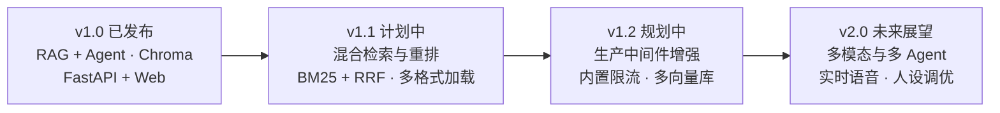

# 项目路线图 (Roadmap)

本文档记录 **Know Me** 开源项目的后续演进规划与特性路线图。我们致力于构建一个轻量、高效、安全且易于扩展的个人数字分身（Personal Digital Twin）框架。

---

## 路线图概览 (Phased Roadmap)

---

## 阶段规划详情

### 阶段一：检索精度与重排优化 (v1.1)
- **混合检索 (Hybrid Retrieval)**：
  - 引入 BM25 稀疏检索算法，结合当前的 Dense 向量嵌入检索。
  - 使用倒数排名融合（Reciprocal Rank Fusion, RRF）合并多路召回结果，提升精准专有名词与技术术语的检索命中率。
- **重排序管线 (Re-ranking Pipeline)**：
  - 支持接入轻量级 Cross-Encoder 或在线 Reranker API，对初筛召回的 Top-K 语料片段进行精细化打分过滤。
- **文档加载与解析器增强**：
  - 增加对 PDF、DOCX、Notion 导出包及结构化简历 JSON 的一键解析与智能分块支持。

### 阶段二：生产级服务与安全加固 (v1.2)
- **内置应用层限流中间件 (Rate Limiting Middleware)**：
  - 在 FastAPI 中内置基于令牌桶算法（Token Bucket）的请求限流中间件。
  - 支持单机内存模式与多实例共享的 Redis 分布式限流后端。
- **多向量数据库适配器 (Multi-VectorDB Adapters)**：
  - 扩展向量数据库驱动层接口，支持 Milvus、Qdrant、PGVector 等生产级外部向量数据库。
- **标准化可观测性集成 (Observability)**：
  - 暴露 Prometheus 兼容的 `/metrics` 端点（监控 QPS、请求延迟、召回分数、Token 消耗）。
  - 集成 OpenTelemetry 标准链路追踪（Distributed Tracing）。
- **生态分发与打包**：
  - 正式发布至 PyPI，支持 `pip install know-me` 直接安装。

### 阶段三：多模态与高级智能体协同 (v2.0)
- **实时语音交互 (Voice / Speech Stream)**：
  - 支持 WebSocket / WebRTC 实时语音对话流（STT 语音转文字 + TTS 语音合成输出）。
- **领域多 Agent 协同协作**：
  - 拆分专家 Agent（如：技术架构专家、HR 面试官助手、项目细节剖析器），通过 Router Agent 进行意图分发。
- **人设调校工作台 (Persona Playground)**：
  - 提供本地 WebUI 人设调试与即时预览工具，支持语料分块可视化调试与 Prompt 评测比较。

---

## 参与与贡献

我们欢迎社区针对上述路线图提出建议或提交 RFC（Request for Comments）。如果你有兴趣参与其中某项特性的开发，请参考 [CONTRIBUTING.md](../CONTRIBUTING.md) 或在 GitHub Discussions / Issues 中与维护者交流！
