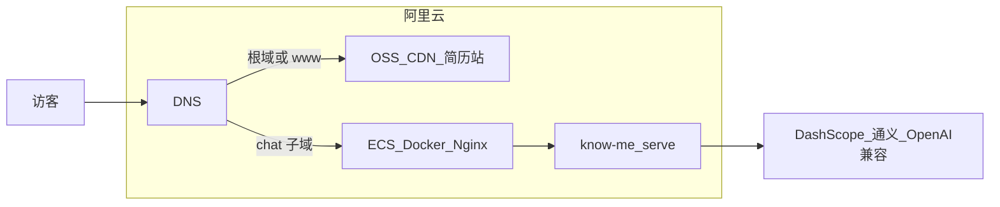

# 阿里云部署指南（聊天 + 简历站 · 云端模型）

本指南对应选型：**B + B**

- **B（范围）**：发布聊天服务（`know-me`）+ 简历静态站（`know-me-showcase`）
- **B（模型）**：使用阿里云通义（DashScope）等 **OpenAI 兼容云 API**，ECS 上不跑本地大模型

> **已有 ECS、域名、OSS、API Key？**  
> - 最短清单：[deploy-aliyun-checklist.md](./deploy-aliyun-checklist.md)  
> - **ECS 一键脚本**：[deploy/install-ecs.sh](../deploy/install-ecs.sh)



---

## 0. 前置 Cond

| 项 | 说明 |
|----|------|
| 阿里云账号 | 已实名；开通 ECS、OSS、（可选）CDN、（可选）ACR |
| 域名 | 建议：`chat.example.com` → 聊天；`example.com` → 简历站 |
| GitHub | 框架 [`hoyo0210/know-me`](https://github.com/hoyo0210/know-me)；简历 [`hoyo0210/know-me-showcase`](https://github.com/hoyo0210/know-me-showcase)（Private） |
| DashScope | 开通 [百炼 / DashScope](https://dashscope.console.aliyun.com/)，拿到 API Key |

把下文 `example.com` / `chat.example.com` 换成你的真实域名即可。

---

## 1. 通义（DashScope）模型配置

OpenAI 兼容根地址（须含 `/v1`）：

```bash
KNOW_ME_OPENAI_BASE_URL=https://dashscope.aliyuncs.com/compatible-mode/v1
KNOW_ME_OPENAI_API_KEY=<你的_DASHSCOPE_API_KEY>
KNOW_ME_OPENAI_CHAT_MODEL=qwen-plus          # 按控制台可选模型调整
KNOW_ME_OPENAI_EMBED_MODEL=text-embedding-v3 # 建索引与检索必须一致
```

上线前在 ECS 上对**真实** `corpus/`、`persona/` 执行一次：

```bash
know-me build-index --corpus-root /data/know-me/corpus
```

（Compose 生产示例见 `deploy/docker-compose.prod.yml.example`。）

---

## 2. 聊天服务：ECS + Docker + Nginx

### 2.1 机器建议

- 地域：靠近用户（如华南 1）
- 规格起步：2 vCPU / 4GB（无本地推理足够）；磁盘 ≥ 40GB
- 安全组入站：`22`（建议仅办公 IP）、`80`、`443`
- 系统：Ubuntu 22.04 / Alibaba Cloud Linux 3

安装 Docker 与 Compose 插件后，将仓库或镜像放到机器上。

### 2.2 目录约定（示例）

```text
/opt/know-me/
  docker-compose.yml    # 由 deploy/docker-compose.prod.yml.example 复制修改
  .env                  # 密钥，chmod 600
  corpus/               # 真实语料（勿进 Git）
  persona/              # IDENTITY.md / SOUL.md
  data/                 # chroma + chat.sqlite
deploy/nginx-know-me.conf  # 反代配置
```

### 2.3 环境变量要点

```bash
KNOW_ME_CORPUS_ROOT=/data/corpus          # 与 volume 挂载一致
KNOW_ME_PERSONA_DIR=/data/persona
KNOW_ME_CHAT_SQLITE_PATH=/data/chat.sqlite
KNOW_ME_RESUME_BROWSER_URL=https://example.com   # 简历站公网 URL
# 若聊天挂在根路径，一般不必设 BROWSER_PREFIX
```

### 2.4 Nginx（SSE 关键）

使用仓库内 [`deploy/nginx-know-me.conf.example`](../deploy/nginx-know-me.conf.example)：

- `proxy_read_timeout` / `proxy_send_timeout` ≥ **300s**
- 关闭或加大缓冲，避免 SSE 被攒包
- 证书：可用阿里云免费证书，或本机 `certbot`

### 2.5 发布检查

```bash
curl -sf https://chat.example.com/health
# 浏览器打开 https://chat.example.com/ 试聊一轮
```

生产务必：限流（Nginx `limit_req` 或后续应用层）、仅开放 443、定期备份 `/data`。

---

## 3. 简历站：OSS + CDN

在 **Private** 仓库 `know-me-showcase` 中构建：

```bash
cd resume-site
cp .env.example .env.production   # 设置 VITE_CHAT_URL=https://chat.example.com
npm ci
npm run build                     # 产出 dist/
```

### 3.1 OSS

1. 创建 Bucket（公共读 **或** 仅 CDN 回源；个人站常用「公共读」+ CDN）
2. 开启 **静态网站**，默认首页 `index.html`
3. 上传 `dist/` 全部文件（可用 ossutil / 控制台）

### 3.2 域名与 HTTPS

1. OSS 绑定自定义域名 `example.com` / `www.example.com`
2. 建议前面加 **CDN**，证书用阿里云 SSL
3. DNS：CNAME 到 CDN / OSS 给定域名

### 3.3 与聊天互链

| 配置 | 位置 | 值 |
|------|------|-----|
| `VITE_CHAT_URL` | showcase 构建时 | `https://chat.example.com` |
| `KNOW_ME_RESUME_BROWSER_URL` | 聊天 `.env` | `https://example.com` |

---

## 4. 可选：GitHub Actions 自动发布

### 聊天（ECS）

- Secrets：`ECS_HOST`、`ECS_SSH_KEY`、或 ACR 登录信息
- `main` push 后：build →（推 ACR）→ SSH `docker compose pull && up -d`

### 简历（OSS）

- Secrets：`ALIYUN_ACCESS_KEY_ID`、`ALIYUN_ACCESS_KEY_SECRET`、`OSS_BUCKET`、`OSS_ENDPOINT`
- showcase `main` push 后：`npm run build` → `ossutil cp -r dist/ oss://...`

OIDC + RAM 角色比长期 AccessKey 更安全（后续可升级）。

本仓库暂不强制附带生产密钥工作流；需要时可再加 `deploy` workflow 模板。

---

## 5. 上线清单

- [ ] DashScope Key 与 chat/embed 模型 id 已验证（本地 `query` 或容器内试聊）
- [ ] 真实 `corpus/` / `persona/` 已挂载并 `build-index`
- [ ] `https://chat…/health` 200；SSE 长对话不断开
- [ ] 简历站 HTTPS 可打开；「去对话」指向 chat 域
- [ ] 聊天页「简历」指向简历域（`KNOW_ME_RESUME_BROWSER_URL`）
- [ ] 安全组最小化；`.env` 权限 600；`/data` 有备份策略
- [ ] Nginx 限流或 WAF（见 [SECURITY.md](../SECURITY.md)）

---

## 6. 费用粗算（量级）

- ECS 轻量 / 入门：每月几十～百元级（视规格）
- OSS + CDN：流量费，个人站通常很低
- DashScope：按 token，与调用量相关

以控制台实时报价为准。
