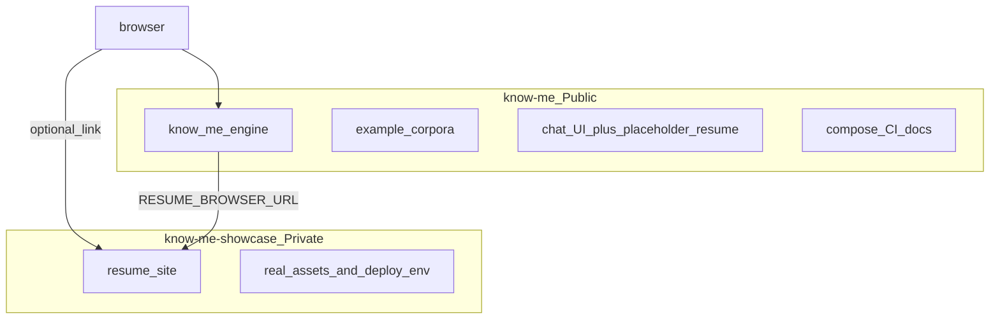

# Know Me — 正式开源产品设计

**日期：** 2026-08-20  
**状态：** 待用户审阅（brainstorm §1–§3 已口头确认）  
**方法：** Superpowers brainstorming → 本 spec → writing-plans → 分任务执行  

---

## 1. 目标与成功标准

将 **Know Me** 做成可对外 **Public** 的开源产品（个人数字分身框架），使陌生人能：

1. 理解产品是什么、不是什么  
2. 用示例语料 + 自备 OpenAI 兼容网关跑通服务  
3. 用 Docker Compose 启动应用层，并看到健康检查通过  

**里程碑完成定义（DoD）：**

- 框架仓 GitHub 为 **Public**，有 tag（建议 `v1.0.0`）  
- README + Compose Quickstart 可复现；CI 对 `/health` smoke 通过  
- 框架仓无真人简历源码、无真人头像/微信码、代码默认值无个人域名/微信链  
- 开源门面齐全：`CONTRIBUTING` / `SECURITY` / `CHANGELOG` / 脱敏 `docs/ROADMAP.md` / 免责声明  
- 存在占位 `/resume` 与通用占位图  
- Private showcase 仓已建立并承接真人站（允许与 Public 并行；**真人内容不得留在 Public 仓**）  

**非目标（本里程碑不做）：**

- PyPI 发布  
- 多租户 / SaaS 计费权限  
- 混合检索、rerank、查询改写  
- Compose 内捆绑推理模型镜像  
- 将本地 `.product/` 私有 PRD 全文开源  
- 代码级全局限流作为硬门禁（文档与示例必须提示；实现列入 ROADMAP 下一版）  

---

## 2. 产品定位

**Know Me** 是开源的 **Personal Digital Twin** 框架：授权 Markdown 语料 → 向量索引 → RAG Agent → 可自托管的聊天 API/UI；覆盖 HR 初筛类公开口径与拒答边界。

**不承诺：** 替代真人沟通、录用/薪酬承诺、法律意见。

---

## 3. 仓库架构（方案 B — 双仓并行）

### 3.1 框架仓（目标 Public，名暂定 `know-me`）

| 包含 | 不包含 |
|------|--------|
| `know_me/` 引擎 | `resume-site/` 真人源码 |
| `corpus.example/` / `persona.example/` / `eval.example/` | 真实 `corpus/` / `persona/` / `data/` / `eval/` |
| 通用聊天 UI + **占位** `/resume` + 通用占位图 | 真人 `avatar.png` / `wechat_qr.png` |
| Docker Compose（API+UI，模型外挂） | 生产密钥、真实微信加好友链作为默认值 |
| CI、`docs/`、开源门面文件 | `.product/` 全文、本地 `.env` |

**远端：** 保留现有 eplistudio `origin`；新增 GitHub remote `github`。

### 3.2 Showcase 仓（Private，名建议 `know-me-showcase`）

- 迁入：`resume-site/`、真人静态资源、无密钥的生产 env 示例、部署说明（`lihaoxu.cn` / `chat.lihaoxu.cn`）  
- 框架通过配置外链（如 `KNOW_ME_RESUME_BROWSER_URL`）指向**已部署**演示站  
- README 可说明作者演示站 URL；**不要求**公开 clone 私有源码  

---

## 4. 交付物清单

### 4.1 框架仓

1. **引擎定版**：将当前未提交的业务增强纳入版本（经安全审计）  
2. **去个人化**：所有默认 URL/文案/图片中性化（见 §5）  
3. **占位 resume**：`/resume` 保留极简占位主题，无真人姓名与项目  
4. **占位图**：中性 avatar；微信区为「配置你的二维码」类占位  
5. **Compose**：服务 Know Me HTTP；模型经 env 指向宿主机/远端 OpenAI 兼容网关  
6. **CI**：构建或 `compose up` 后请求 `/health`  
7. **门面**：`CONTRIBUTING.md`、`SECURITY.md`、`CHANGELOG.md`、免责声明（独立文件或 README 专节）  
8. **路线图**：`docs/ROADMAP.md`（从本地 PRD/backlog **脱敏**摘要）  
9. **本设计与实现计划**：`docs/superpowers/specs/`、`docs/superpowers/plans/`  

### 4.2 Showcase 仓

1. 真人 `resume-site` 与构建配置  
2. 真人图片与部署说明  
3. 与框架聊天域名的联调说明  

---

## 5. 去个人化规则

框架仓代码与默认配置中：

- **禁止**硬编码：`lihaoxu.cn`、`chat.lihaoxu.cn`、真人微信 `u.wechat.com/...`、真实姓名文案（如「李昊旭」）作为默认展示  
- **默认值**：简历外链为空或文档示例域名（如 `https://example.com`）；由 env 覆盖  
- **迁移**：`resume-site/` 整目录迁出到 showcase，不保留在框架默认树中  
- **扫描门禁**：改 Public 前全文检索个人域名/微信链/真人姓名；CI 可选加简单 grep 检查  

作者演示站 URL 仅允许出现在 README「作者演示」说明中，**不得**作为运行时默认回退。

---

## 6. Quickstart 与运维

- **档位：** Compose 编排应用层；**模型外挂**  
- 文档写清：配置 `KNOW_ME_OPENAI_BASE_URL` / embed / chat model，对 `corpus.example` 建索引（可在文档中提供 compose profile 或一次性 init 说明）  
- CI：不依赖真实大模型；`/health` 必须绿  
- 反代/超时：文档注明 SSE 与 `proxy_read_timeout` 建议  

---

## 7. 安全与合规

- `.gitignore` 继续排除：`.env`、`corpus/`、`persona/`、`data/`、`.product/`、`eval/`  
- `POST /ingest`：未配置密钥则不可用（维持现状）  
- `SECURITY.md`：漏洞报告方式；警告公开暴露 `/chat` 的滥用风险与限流/WAF 建议  
- CORS：生产示例收紧 origin；开发可放宽  
- 限流：**本里程碑以文档+示例为主**；代码限流进 ROADMAP 下一版（除非后续变更本 spec）  
- 许可证：维持 MIT；界面/文档含 HR/非承诺免责声明  

---

## 8. 发布节奏

1. 本地审计与框架向提交（脱敏、占位、门面、Compose、CI）  
2. 并行初始化 Private showcase 并迁入真人站  
3. 框架推送 GitHub（可先 Private 做最终扫描）→ CI 绿  
4. Tag `v1.0.0` → 仓库设为 **Public**  
5. 分支收尾使用 Superpowers `finishing-a-development-branch`（merge / PR 等由维护者选择）  
6. 是否同步 eplistudio `origin`：可选，非 DoD  

---

## 9. 验收检查表

- [ ] Compose + 外挂网关可起服务并打开聊天 UI  
- [ ] CI `/health` smoke 通过  
- [ ] 框架仓无 `resume-site/`、无真人 png、默认配置无个人域名/微信链  
- [ ] 占位 `/resume` 与占位图可用  
- [ ] `CONTRIBUTING` / `SECURITY` / `CHANGELOG` / `docs/ROADMAP.md` 存在  
- [ ] 框架仓 GitHub **Public** + tag  
- [ ] Private showcase 含真人站；Public 仓无真人内容  

---

## 10. 后续实现计划入口

本 spec 批准后，使用 **superpowers:writing-plans** 生成：

`docs/superpowers/plans/2026-08-20-know-me-oss-v1.md`

执行时优先 **subagent-driven-development** + **using-git-worktrees**，完成后 **finishing-a-development-branch**。

---

## 11. 决策记录（brainstorm）

| 项 | 选择 |
|----|------|
| 里程碑 | Public v1（含 Quickstart/CI/Roadmap） |
| 简历站 | 独立 Private showcase 仓 |
| 框架 `/resume` | 保留空白/占位主题 |
| Quickstart | Compose 应用层 + 外挂模型 |
| Showcase 可见性 | Private |
| 聊天页素材 | 通用占位图 |
| 总体方案 | B 双仓并行 |
